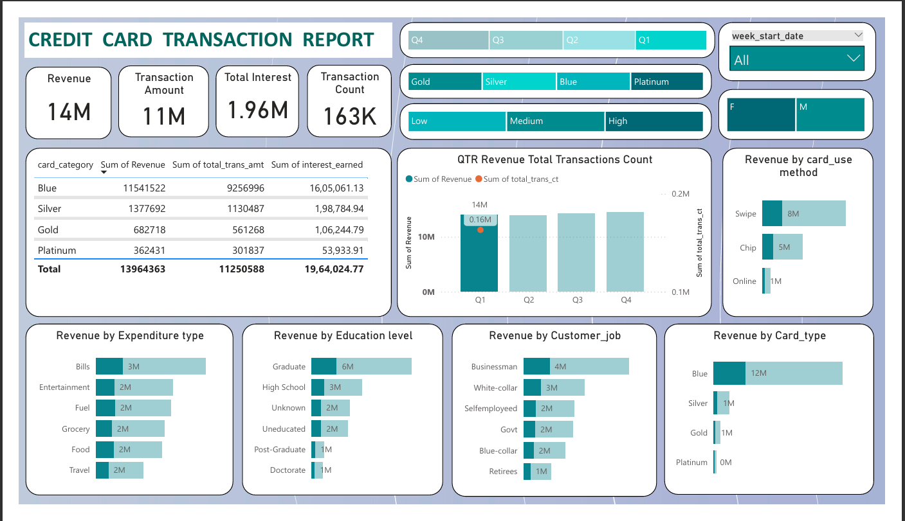

# Credit-Card-Financial-Dashboard
An interactive and real-time Credit Card Financial Dashboard built using Power BI and PostgreSQL, designed to monitor weekly and year-to-date (YTD) performance metrics, trends, and key KPIs. The dashboard empowers stakeholders with actionable insights to drive data-informed decisions in credit card operations.

---

## Project Objective

To develop a comprehensive, interactive credit card dashboard that enables real-time monitoring of key financial and operational metrics. The goal is to provide stakeholders with insights to evaluate revenue trends, customer engagement, card activity, and delinquency risk to support better business decision-making.

---

## Business Task

- Build a weekly credit card performance monitoring dashboard
- Track revenue, transaction volume, interest, and customer activity
- Monitor activation and delinquency rates
- Segment data by demographics, card types, and geography
- Support business decisions with timely and accurate insights

---

## Business Questions

- What is the weekly and cumulative revenue performance?
- How do transaction volume and count evolve week over week?
- Which card types contribute the most to transaction activity?
- How do customer demographics (gender, state) impact revenue?
- What are the current activation and delinquency rates?

---

## Tools (Tech Stack)

- **Power BI**: Used to build interactive dashboards with dynamic filtering, trend charts, and performance cards.
- **PostgreSQL**: Served as the backend database for customer and transaction data.
- **SQL**: Applied for data transformation, joins, and aggregations before visualization.
- **DAX (in Power BI)**: Used to create calculated columns like age group and income brackets, define custom revenue metrics, and implement week-over-week comparison logic.

---

## Dataset

The dataset includes anonymized customer and transaction records, pulled from a **PostgreSQL** database and refreshed weekly into Power BI:

- **Customer Table**: Gender, state, card type, activation status
- **Transaction Table**: Transaction date, amount, interest, transaction type
- Dataset supports real-time performance monitoring and historical comparison

---

## Features

- Real-time KPI tracking for credit card revenue, interest, and transactions
- Weekly trend analysis with WoW comparisons
- Demographic segmentation: gender, state, and card type
- Monitoring of delinquency and activation rates
- State-wise and category-wise performance breakdown
- Visual storytelling through dynamic charts and maps

---

## Data Analysis Highlights

- Revenue increased by **28.8%** week-over-week
- Transaction amount and count saw strong weekly growth
- YTD Revenue: **$57M**
- Total Interest Earned: **$8M**
- Total Transaction Amount: **$46M**
- **Male customers** contributed **$31M**, and **female customers** contributed **$26M**
- **Blue and Silver cards** represent **93%** of all transactions
- Top states: **TX, NY, and CA** contribute **68%** of total activity
- Activation Rate: **57.5%**
- Delinquency Rate: **6.06%**

---

## Outcome

- Delivered a centralized dashboard for credit card KPIs
- Enabled informed decision-making based on weekly metrics
- Identified top-performing customer segments and geographic regions
- Monitored key risk and engagement metrics (activation and delinquency)
- Streamlined business reporting with a single source of truth

---

## Dashboard Preview

